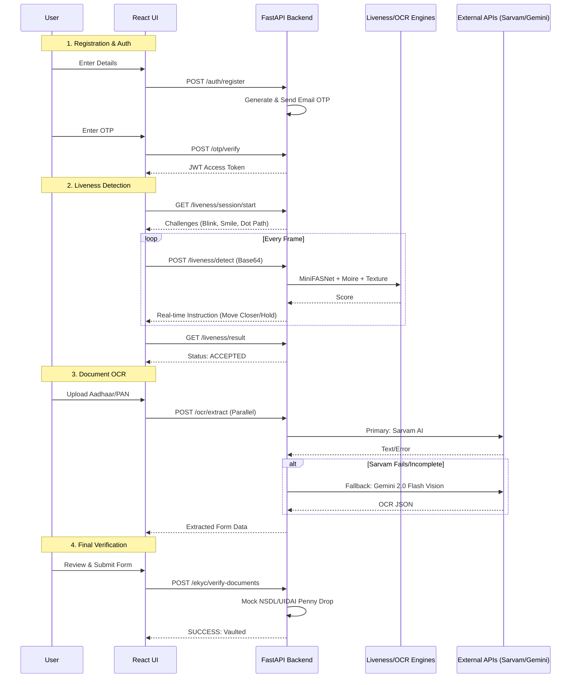
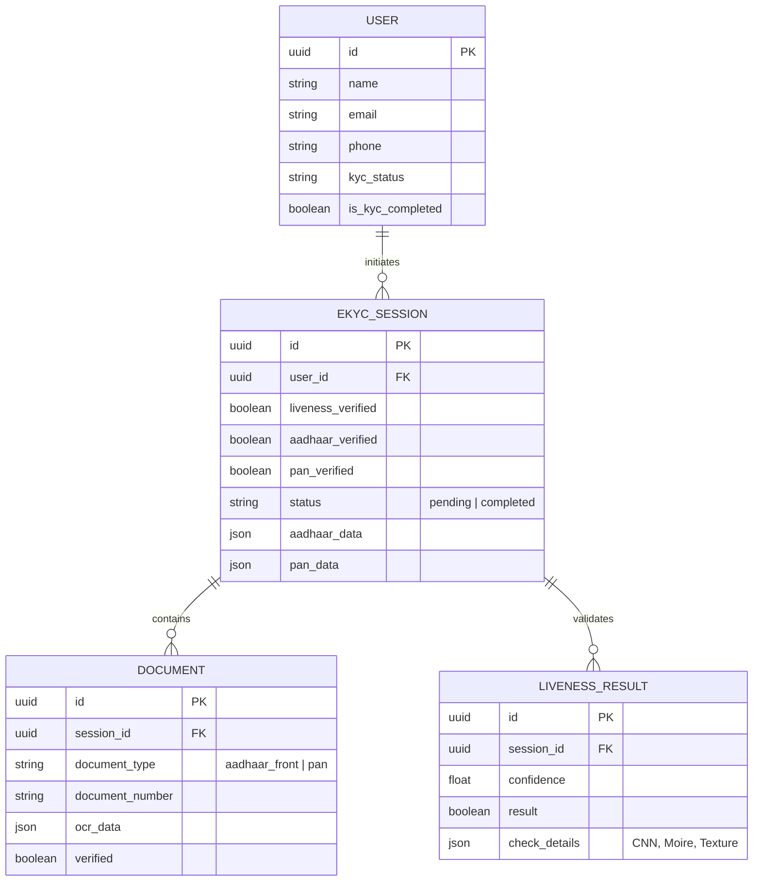
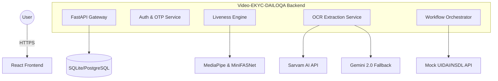

# 🛡️ Video-EKYC-DAILOQA

An advanced, real-time Digital Identity Verification platform. This system implements a robust Video-eKYC workflow involving AI-driven liveness detection, document OCR, and multi-factor authentication.

---

## 🚀 The e-KYC Flow: Step-by-Step

Our platform follows a strict state-machine logic to ensure every user is verified with high confidence.

### 1. User Registration & Auth 🔐

- **Landing Page**: Users arrive at a high-performance landing page presenting the security benefits and process overview.
- **Secure Signup**: Registration requires a valid email.
- **OTP Verification**: A 6-digit OTP is dispatched via SMTP to the user's email to verify identity before granting access to the dashboard.

### 2. Multi-Layered Liveness Detection 👤

Before documents are even uploaded, we ensure the user is a live human being.
- **CNN Anti-Spoofing**: Uses **MiniFASNetV2** (ONNX) to distinguish between a real human face and a high-resolution photo or digital mask.
- **Moire & Texture Analysis**: Detects the "moire" patterns typically created when a camera films a digital screen (preventing screen-replay attacks).
- **Behavioral Dot Tracking**: The UI prompts the user to follow a moving dot with their eyes/head. The backend validates whether the head movement coordinates match the randomly generated path.
- **Deepfake Analysis**: Periodic snapshots are taken and analyzed to detect synthetic face-swaps or AI-generated video overlays.

### 3. Smart Document Capture & OCR 📄

We utilize a primary-and-fallback mechanism to ensure maximum extraction accuracy for Indian ID cards (Aadhaar & PAN).
- **Sarvam API (Primary)**: The system first attempts extraction using Sarvam’s `doc-digitization` (Azure-backed) service for highly accurate field mapping.
- **Gemini 2.0 Flash (Fallback)**: If Sarvam fails due to image quality or API limits, we fall back to **Google's Gemini 2.0 Flash Vision** model to extract data directly from the image.
- **Aadhaar Dual-Side Logic**: The system intelligently merges data from Aadhaar Front (Name, DOB, Gender, Number) and Aadhaar Back (Full Address) into a single verified profile.

### 4. Identity Validation (UIDAI & PAN Check) 🔍

- **Deepvue/NSDL Check**: Extracted Aadhaar and PAN numbers are cross-referenced with centralized databases to ensure the ID is active and valid.
- **Data Consistency**: The system cross-checks the name and DOB across both Aadhaar and PAN documents to ensure they belong to the same individual.

### 5. Bank Verification (Penny Drop / API) 🏦

- **Account Validation**: The user provides bank details (or they are derived).
- **Penny Drop Logic**: A mock/live bank verification (NSDL/UIDAI Mock) confirms the account holder matches the KYC-verified name.
- **Final Cross-Check**: Confirmation that the "Identity Vault" linkage is consistent across all government records.

### 6. Finalizing e-KYC ✅

- **Review Screen**: The user reviews all AI-extracted information one last time.
- **Digital Vaulting**: Upon submission, the session is marked as `COMPLETED`.
- **Audit Trail**: All snapshots, OCR logs, and liveness scores are stored for compliance auditing.

---

## 🛠️ Tech Stack

| Component | Technology |
| :--- | :--- |
| **Backend** | Python, FastAPI, SQLAlchemy, Pydantic |
| **AI/ML** | MediaPipe Face Landmarker, MiniFASNet, InsightFace, ONNX Runtime |
| **Frontend** | React.js, Vite, Tailwind CSS, Lucide Icons, Axios |
| **APIs** | Sarvam AI, Google Gemini AI (Flash 2.0), SMTP for OTP |
| **Storage** | SQLite (Dev) / PostgreSQL (Prod) |

---

## 📂 Project Structure

├── backend/ # 🔧 Core backend (FastAPI + AI services)
│ ├── .venv/ # Python virtual environment
│
│ ├── app/ # Main application source
│ │
│ │ ├── api/ # 🌐 API layer (routes/controllers)
│ │ │ └── v1/ # Versioned API (v1)
│ │ │ ├── auth_routes.py # User auth (register/login/JWT)
│ │ │ ├── ekyc_routes.py # e-KYC orchestration endpoints
│ │ │ ├── liveness_routes.py # Real-time liveness detection APIs
│ │ │ ├── ocr_routes.py # Document OCR endpoints
│ │ │ └── otp_routes.py # Email OTP verification
│ │ │
│ │ ├── core/ # ⚙️ Core utilities & configs
│ │ │ ├── config.py # Environment + app configuration
│ │ │ ├── otp.py # OTP generation logic
│ │ │ └── security.py # JWT, hashing, auth utilities
│ │ │
│ │ ├── models/ # 🤖 ML models & assets
│ │ │ ├── insightface/ # Face recognition models
│ │ │ ├── face_landmarker.task # MediaPipe face tracking model
│ │ │ └── minifasnet.onnx # Anti-spoofing CNN model
│ │ │
│ │ ├── schemas/ # 📦 Pydantic schemas (data contracts)
│ │ │ ├── document/ # OCR & document schemas
│ │ │ ├── ekyc/ # e-KYC workflow schemas
│ │ │ ├── liveness/ # Liveness request/response schemas
│ │ │ └── user/ # User/auth schemas
│ │ │
│ │ ├── services/ # 🧠 Business logic & AI engines
│ │ │
│ │ │ ├── email_verification/ # 📧 OTP email service
│ │ │ │ ├── generate_otp.py # Generate OTP
│ │ │ │ └── verify_otp.py # Validate OTP
│ │ │ │
│ │ │ ├── liveness/ # 👤 Multi-layer liveness detection engine
│ │ │ │ ├── behavioral_service.py # Head/eye movement tracking
│ │ │ │ ├── deepfake_service.py # Deepfake detection (Reality Defender)
│ │ │ │ ├── depth_service.py # Depth/3D face validation
│ │ │ │ ├── dot_service.py # Dot tracking logic
│ │ │ │ ├── liveness_engine.py # Orchestrator (combines all signals)
│ │ │ │ ├── minifasnet_service.py # CNN anti-spoofing
│ │ │ │ ├── moire_service.py # Screen replay detection
│ │ │ │ └── texture_service.py # Texture-based spoof detection
│ │ │ │
│ │ │ ├── ocr/ # 📄 Document intelligence layer
│ │ │ │ ├── extraction_service.py # OCR pipeline controller
│ │ │ │ ├── gemini_service.py # Gemini fallback OCR
│ │ │ │ └── sarvam_service.py # Primary OCR (Sarvam API)
│ │ │ │
│ │ │ ├── bank_verification.py # 🏦 Bank account validation logic
│ │ │ └── email_service.py # Email sender (SMTP integration)
│ │ │
│ │ ├── session/ # 🔄 Session lifecycle management
│ │ ├── config.py # App-level config (fallback/global)
│ │ ├── db.py # Database connection & session
│ │ ├── main.py # 🚀 FastAPI entrypoint
│ │ └── models.py # SQLAlchemy DB models
│ │
│ ├── session_snapshots/ # 📸 Stored frames (liveness + deepfake checks)
│ ├── .env # Environment variables (API keys, DB, etc.)
│ ├── pyproject.toml # Python project configuration
│ ├── uv.lock # Dependency lock file
│ └── backend.md # Backend-specific documentation
│
├── frontend/ # 🎨 React frontend (Vite + Tailwind)
│ ├── node_modules/ # Dependencies
│ │
│ ├── src/ # Main frontend source
│ │ ├── components/ # 🧩 UI + feature components
│ │ │
│ │ │ ├── ui/ # Reusable design system components
│ │ │ │ ├── button.jsx
│ │ │ │ ├── card.jsx
│ │ │ │ └── input.jsx
│ │ │ │
│ │ │ ├── AuthPage.jsx # Login/Register UI
│ │ │ ├── BankVerification.jsx # Bank verification UI
│ │ │ ├── Dashboard.jsx # User dashboard
│ │ │ ├── DocumentCapture.jsx # Upload/capture documents
│ │ │ ├── DocumentReview.jsx # Review extracted data
│ │ │ ├── LandingPage.jsx # Marketing/landing page
│ │ │ ├── LivenessDetection.jsx# Real-time liveness UI
│ │ │ ├── ProcessSteps.jsx # Step-by-step flow UI
│ │ │ ├── ResultScreen.jsx # Final verification result
│ │ │ ├── StepIndicator.jsx # Progress tracker
│ │ │ └── WelcomeScreen.jsx # Entry screen
│ │ │
│ │ ├── lib/ # Utility helpers
│ │ │ └── utils.js
│ │ │
│ │ ├── services/ # 🔌 API integration layer
│ │ │ └── api.js # Axios client (backend communication)
│ │ │
│ │ ├── utils/ # Custom logic
│ │ │ └── dotTracker.js # Behavioral liveness tracking logic
│ │ │
│ │ ├── App.jsx # Root component
│ │ ├── index.css # Global styles
│ │ └── main.jsx # React entrypoint
│ │
│ ├── index.html # HTML template
│ ├── package.json # Project dependencies
│ ├── package-lock.json
│ ├── postcss.config.js
│ ├── tailwind.config.js # Tailwind styling config
│ ├── vite.config.js # Vite bundler config
│ └── frontend.md # Frontend documentation
│
├── .gitignore
└── README.md

---

## 🔄 Multi-Layered Technical Sequence

---

## 📊 Entity Relationship (ER) Diagram

---

## 🏛️ High-Level Design (HLD)

---

## 📡 API Endpoints Reference

### 🛡️ Authentication
```bash
# Register a new user
$ curl -X POST http://localhost:8000/api/v1/auth/register \
   -H "Content-Type: application/json" \
   -d '{"name": "John Doe", "email": "john@example.com", "password": "securepassword"}'

# Login to get Bearer Token
$ curl -X POST http://localhost:8000/api/v1/auth/login \
   -d "username=john@example.com&password=securepassword"
```
 
### 👤 Liveness & Biometrics
```bash
# Start a liveness session
$ curl -X POST http://localhost:8000/api/v1/liveness/session/start \
   -H "Authorization: Bearer <token>"

# Detect spoofing/liveness in a frame
$ curl -X POST http://localhost:8000/api/v1/liveness/detect \
   -H "Authorization: Bearer <token>" \
   -d '{"session_id": "...", "frame": "base64_string...", "dot_vec": {"x": 0.5, "y": 0.5}}'

# Get final results
$ curl -X GET http://localhost:8000/api/v1/liveness/session/result/{session_id} \
   -H "Authorization: Bearer <token>"
```

### 📄 Document OCR (Sarvam + Gemini Fallback)
```bash
# Extract Aadhaar Front
$ curl -X POST http://localhost:8000/api/v1/ocr/extract-aadhaar-front \
   -H "Authorization: Bearer <token>" \
   -F "file=@aadhaar_front.jpg"

# Extract PAN Card
$ curl -X POST http://localhost:8000/api/v1/ocr/extract-pan \
   -H "Authorization: Bearer <token>" \
   -F "file=@pan_card.jpg"
```

### 🏦 e-KYC Orchestration
```bash
# Save OCR data to session
$ curl -X POST http://localhost:8000/api/v1/ekyc/session/save-documents \
   -H "Authorization: Bearer <token>" \
   -d '{"aadhaar_front_data": {...}, "pan_data": {...}}'

# Finalize verification
$ curl -X POST http://localhost:8000/api/v1/ekyc/complete \
   -H "Authorization: Bearer <token>" \
   -d '{"pan_number": "ABCDE1234F", "aadhaar_number": "123456789012"}'
```
---

## ⚙️ Getting Started

### Prerequisites
- Python 3.10+
- Node.js 18+
- [uv](https://github.com/astral-sh/uv) (Recommended for Python)

### 1. Setup Backend
cd backend
uv venv
source .venv/bin/activate  # Windows: .venv\Scripts\activate
uv pip install -e .
python -m app.main

### 2. Setup Frontend
cd backend
uv venv
source .venv/bin/activate  # Windows: .venv\Scripts\activate
uv pip install -e .
python -m app.main

## 🔒 Security Features
- Anti-Spoofing: Protection against high-res photos, video replays, and 3D masks.
- JWT Auth: Secure session management.
- OTP Verification: Email-based verification for user registration.
- Session Snapshots: Captures granular evidence during the liveness process for auditing.

## 📝 License
This project is for internal use and compliance testing.
