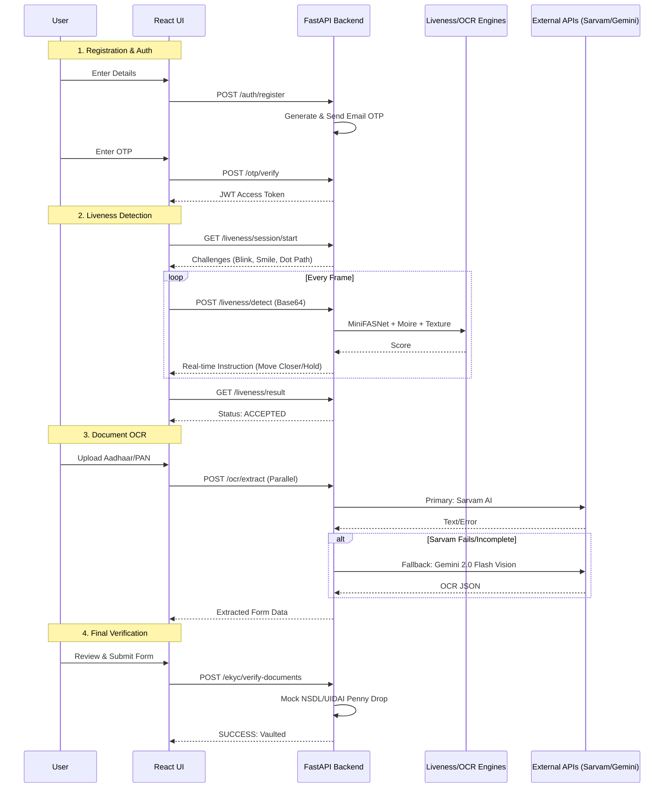
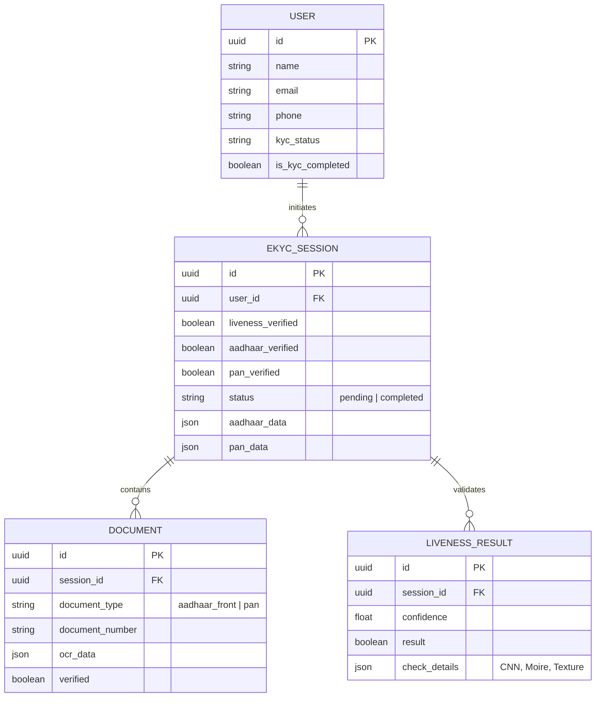
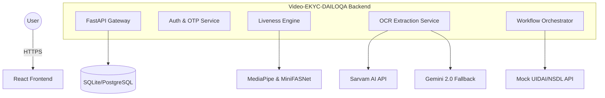

# 🛡️ Video-eKYC-DAILOQA

A **real-time AI-powered Video e-KYC platform** for secure digital identity verification — combining **liveness detection, document intelligence, and multi-factor validation** into a production-ready pipeline.

Built with **FastAPI, React, ONNX models, and multi-layered AI validation**, this system ensures **fraud-resistant onboarding** for fintech and compliance-driven applications.

> **Core Focus:** Prevent spoofing, detect deepfakes, and ensure identity consistency across documents and biometric signals.

---

## Table of Contents

1. [Project Overview](#project-overview)  
2. [Project Structure](#project-structure)  
3. [Quick Start](#quick-start)  
4. [API Endpoints](#api-endpoints)  
5. [System Architecture](#system-architecture)  
6. [e-KYC Pipeline](#e-kyc-pipeline)  
7. [Liveness Detection System](#liveness-detection-system)  
8. [OCR & Document Intelligence](#ocr--document-intelligence)  
9. [Verification & Validation](#verification--validation)  
10. [Database Schema](#database-schema)  
11. [Tech Stack](#tech-stack)  
12. [Security Features](#security-features)  

---

## Project Overview

This platform implements a **state-machine driven Video e-KYC workflow** with multiple AI validation layers:

-  **Biometric Liveness Verification**
-  **Document OCR with fallback intelligence**
-  **Government ID validation**
-  **Bank account verification**
-  **Deepfake & spoof detection**

Unlike basic KYC systems, this solution is designed to be:
- **Cost-efficient**
- **Fraud-resistant**
- **Real-time**
- **Extensible for compliance frameworks (UIDAI / RBI / KYC norms)**

---

## Tech Stack

| Component | Technology |
| :--- | :--- |
| **Backend** | Python, FastAPI, SQLAlchemy, Pydantic |
| **AI/ML** | MediaPipe Face Landmarker, MiniFASNet, InsightFace, ONNX Runtime |
| **Frontend** | React.js, Vite, Tailwind CSS, Lucide Icons, Axios |
| **APIs** | Sarvam AI, Google Gemini AI (Flash 2.0), SMTP for OTP |
| **Storage** | SQLite (Dev) / PostgreSQL (Prod) |

---

## Project Structure
```
.
├── backend/                                 # Core backend (FastAPI + AI services)
│ ├── .venv/                                 # Python virtual environment
│
│ ├── app/                                   # Main application source
│ │
│ │ ├── api/                                 # API layer (routes/controllers)
│ │ │ └── v1/                                # Versioned API (v1)
│ │ │ ├── auth_routes.py                     # User auth (register/login/JWT)
│ │ │ ├── ekyc_routes.py                     # e-KYC orchestration endpoints
│ │ │ ├── liveness_routes.py                 # Real-time liveness detection APIs
│ │ │ ├── ocr_routes.py                      # Document OCR endpoints
│ │ │ └── otp_routes.py                      # Email OTP verification
│ │ │
│ │ ├── core/                                # Core utilities & configs
│ │ │ ├── config.py                          # Environment + app configuration
│ │ │ ├── otp.py                             # OTP generation logic
│ │ │ └── security.py                        # JWT, hashing, auth utilities
│ │ │
│ │ ├── models/                              # ML models & assets
│ │ │ ├── insightface/                       # Face recognition models
│ │ │ ├── face_landmarker.task               # MediaPipe face tracking model
│ │ │ └── minifasnet.onnx                    # Anti-spoofing CNN model
│ │ │
│ │ ├── schemas/                             # Pydantic schemas (data contracts)
│ │ │ ├── document/                          # OCR & document schemas
│ │ │ ├── ekyc/                              # e-KYC workflow schemas
│ │ │ ├── liveness/                          # Liveness request/response schemas
│ │ │ └── user/                              # User/auth schemas
│ │ │
│ │ ├── services/                            # Business logic & AI engines
│ │ │
│ │ │ ├── email_verification/                # OTP email service
│ │ │ │ ├── generate_otp.py                  # Generate OTP
│ │ │ │ └── verify_otp.py                    # Validate OTP
│ │ │ │
│ │ │ ├── liveness/                          # Multi-layer liveness detection engine
│ │ │ │ ├── behavioral_service.py            # Head/eye movement tracking
│ │ │ │ ├── deepfake_service.py              # Deepfake detection (Reality Defender)
│ │ │ │ ├── depth_service.py                 # Depth/3D face validation
│ │ │ │ ├── dot_service.py                   # Dot tracking logic
│ │ │ │ ├── liveness_engine.py               # Orchestrator (combines all signals)
│ │ │ │ ├── minifasnet_service.py            # CNN anti-spoofing
│ │ │ │ ├── moire_service.py                 # Screen replay detection
│ │ │ │ └── texture_service.py               # Texture-based spoof detection
│ │ │ │
│ │ │ ├── ocr/                               # Document intelligence layer
│ │ │ │ ├── extraction_service.py            # OCR pipeline controller
│ │ │ │ ├── gemini_service.py                # Gemini fallback OCR
│ │ │ │ └── sarvam_service.py                # Primary OCR (Sarvam API)
│ │ │ │
│ │ │ ├── bank_verification.py               # Bank account validation logic
│ │ │ └── email_service.py                   # Email sender (SMTP integration)
│ │ │
│ │ ├── session/                             # Session lifecycle management
│ │ ├── config.py                            # App-level config (fallback/global)
│ │ ├── db.py                                # Database connection & session
│ │ ├── main.py                              # FastAPI entrypoint
│ │ └── models.py                            # SQLAlchemy DB models
│ │
│ ├── session_snapshots/                     # Stored frames (liveness + deepfake checks)
│ ├── .env                                   # Environment variables (API keys, DB, etc.)
│ ├── pyproject.toml                         # Python project configuration
│ └── uv.lock                                # Dependency lock file
│
├── frontend/                                # React frontend (Vite + Tailwind)
│ ├── node_modules/                          # Dependencies
│ │
│ ├── src/                                   # Main frontend source
│ │ ├── components/                          # UI + feature components
│ │ │
│ │ │ ├── ui/                                # Reusable design system components
│ │ │ │ ├── button.jsx
│ │ │ │ ├── card.jsx
│ │ │ │ └── input.jsx
│ │ │ │
│ │ │ ├── AuthPage.jsx                       # Login/Register UI
│ │ │ ├── BankVerification.jsx               # Bank verification UI
│ │ │ ├── Dashboard.jsx                      # User dashboard
│ │ │ ├── DocumentCapture.jsx                # Upload/capture documents
│ │ │ ├── DocumentReview.jsx                 # Review extracted data
│ │ │ ├── LandingPage.jsx                    # Marketing/landing page
│ │ │ ├── LivenessDetection.jsx              # Real-time liveness UI
│ │ │ ├── ProcessSteps.jsx                   # Step-by-step flow UI
│ │ │ ├── ResultScreen.jsx                   # Final verification result
│ │ │ ├── StepIndicator.jsx                  # Progress tracker
│ │ │ └── WelcomeScreen.jsx                  # Entry screen
│ │ │
│ │ ├── lib/                                 # Utility helpers
│ │ │ └── utils.js
│ │ │
│ │ ├── services/                            # API integration layer
│ │ │ └── api.js                             # Axios client (backend communication)
│ │ │
│ │ ├── utils/                               # Custom logic
│ │ │ └── dotTracker.js                      # Behavioral liveness tracking logic
│ │ │
│ │ ├── App.jsx                              # Root component
│ │ ├── index.css                            # Global styles
│ │ └── main.jsx                             # React entrypoint
│ │
│ ├── index.html                             # HTML template
│ ├── package.json                           # Project dependencies
│ ├── package-lock.json
│ ├── postcss.config.js
│ ├── tailwind.config.js                     # Tailwind styling config
│ ├── vite.config.js                         # Vite bundler config
│ └── frontend.md                            # Frontend documentation
│
├── .gitignore
└── README.md
```
---

## ⚡ Quick Start

### 1. Backend Setup

```bash
cd backend
uv venv
source .venv/bin/activate   # Windows: .venv\Scripts\activate
uv pip install -e .
```
### 2. Start the server

```bash
cd backend
uvicorn app.main:app --reload
```
### 3. Frontend Setup

```bash
cd frontend
npm install
npm run dev
```
---

##  API Endpoints

| Method | Path | Auth | Description |
|--------|------|------|-------------|
| `POST` | `/api/v1/auth/register` | — | Register a new user |
| `POST` | `/api/v1/auth/login` | — | Authenticate user and return JWT |
| `POST` | `/api/v1/otp/verify` | — | Verify email OTP |

### Liveness & Biometrics

| Method | Path | Auth | Description |
|--------|------|------|-------------|
| `POST` | `/api/v1/liveness/session/start` | Bearer Token | Start liveness session |
| `POST` | `/api/v1/liveness/detect` | Bearer Token | Analyze frame for liveness & spoofing |
| `GET` | `/api/v1/liveness/session/result/{session_id}` | Bearer Token | Get final liveness result |

### Document OCR

| Method | Path | Auth | Description |
|--------|------|------|-------------|
| `POST` | `/api/v1/ocr/extract-aadhaar-front` | Bearer Token | Extract Aadhaar front details |
| `POST` | `/api/v1/ocr/extract-pan` | Bearer Token | Extract PAN card details |

### e-KYC Workflow

| Method | Path | Auth | Description |
|--------|------|------|-------------|
| `POST` | `/api/v1/ekyc/session/save-documents` | Bearer Token | Save extracted OCR data |
| `POST` | `/api/v1/ekyc/complete` | Bearer Token | Finalize e-KYC verification |

### Utility

| Method | Path | Auth | Description |
|--------|------|------|-------------|
| `GET` | `/health` | — | Health check endpoint |

---

## Multi-Layered Technical Sequence

---

## Entity Relationship (ER) Diagram

---

## High-Level Design (HLD)

---

## Security Features
- Anti-Spoofing: Protection against high-res photos, video replays, and 3D masks.
- JWT Auth: Secure session management.
- OTP Verification: Email-based verification for user registration.
- Session Snapshots: Captures granular evidence during the liveness process for auditing.

## License
This project is for internal use and compliance testing.
